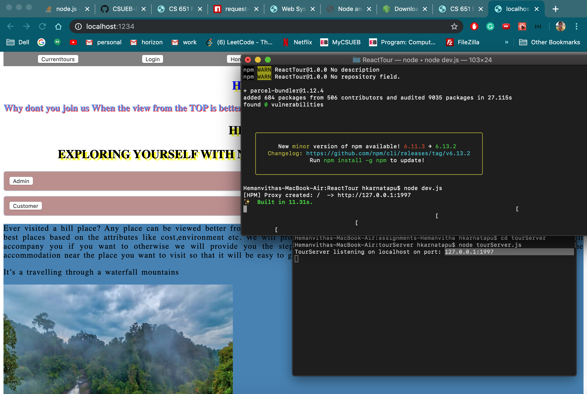
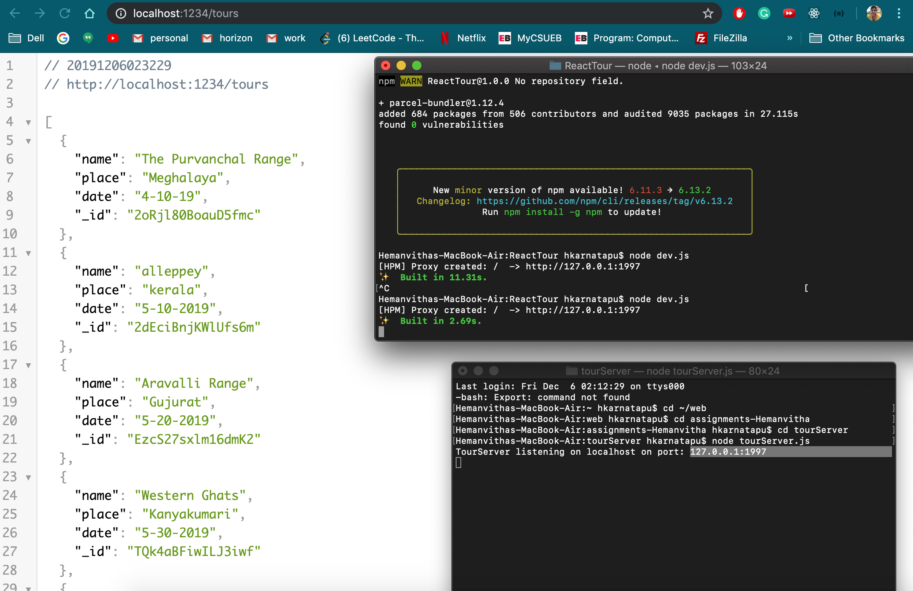
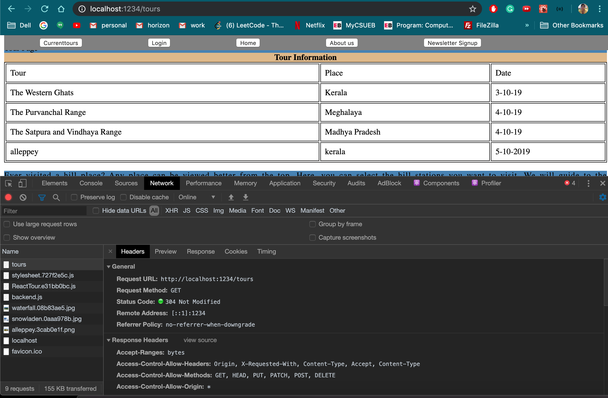

```Code
const Bundler = require('parcel-bundler');
const express = require('express');
const proxy = require('http-proxy-middleware');
const app = express();
const forward = ['/tours'];
app.use(forward, proxy({target: 'http://127.0.0.1:1997'}));
const bundler = new Bundler('./index.html');
app.use(bundler.middleware());
app.listen(1234);
```




